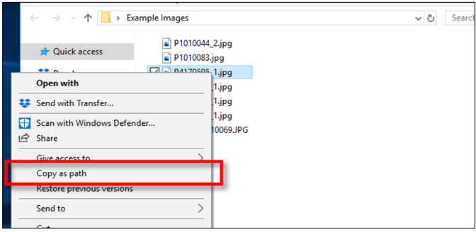

# Mengirim File

Untuk `mengirim file` secara bersamaan ke setiap alamat email yang berbeda, langkah yang harus dilakukan adalah berikut:

1.  Masuk ke halaman (sheet) `send file` 
2.  Input email, subjek, body email, dan path file pada masing-masing kolom sesuai  HEADER

:::info[Penjelasan]
    - `send to` : masukan alamat email yang dituju
    - `cc` : jika ingin menambahkan penerima, maka dapat dimasukan pada kolom ini, bisa di input lebih dari satu alamat email, gunakan `;` untuk penerima yang lebih dari 1
    - `Subject` : subjek email dapat di input pada kolom ini
    - `body message` : Deskripsi email

    <details>
  <summary>Jika ingin menyesuaikan format email menggunakan HTML maka sesuaikan code pada makro</summary>

  ```js title="mengubah body message dengan HTML"
.Body = sh.Cells(cell.Row, 4).Value

```

 ```js title="ubah menjadi code berikut:"
.HTMLBody = sh.Cells(cell.Row, 4).Value

```
   
</details>

  - `Attachment` : file yang akan di attach dapat di input pada **kolom E sd M**
  :::warning[PERHATIKAN]
  file attachement harus di input dengan path name **(atau rincian dimana masing-masing file disimpan)**
  :::

`Contoh`

   | send to| cc | Subject | Body Message | Attachment 1 | Attachment 2 | Attachment dst | 
    |---|---|---|---|---|---|---|
   | zein@gmail.com|ika@gmail.com; abc@gmail.com| Payslip 2025 | Dear Bapak & Ibu .... | D:\zein_slip.pdf | D:\pengumuman.pdf |   | 
   | 123@gmail.com|aaa@gmail.com| Payslip 2025 | Dear Bapak & Ibu .... | D:\anomali_slip.pdf| D:\pengumuman.pdf | c:\spt.pdf| 

:::danger[Perhatikan]

Pastikan file disimpan pada local folder untuk menghindari  error saat mengirim email

:::

4.  Klik button Send File untuk mengirim file **(pada pojok kanan atas)**


:::info[Note]

Untuk beberapa sistem/versi office tertentu mengirim file tanpa attachment tidak bisa dilakukan dan akan menyebabkan error, maka jika akan dilakukan blast email tanpa attachment untuk kolom attachment dapat di isi dengan karakter (contoh: abcd)

:::

:::danger[Additional Note]
File Attacment dapat di input dan dikirim lebih dari satu file dalam satu kali pengiriman
file yang dikirim dapat dalam format apapun `(jpg/pdf/png/txt/xlx.docx, etc)`

Untuk memudahkan dalam mengcopy path file pada kolom dapat menggunakan cara berikut:
(cara ini hanya digunakan untuk versi windows 10 kebawah)

1.  Tekan CTRL +A  untuk memilih semua file yang akan dicopy
2.  Arahkan kursor ke file paling atas, kemudian tekan SHIFT dan klik kanan secara bersamaan
3.  Klik copy as path
4.  Paste path ke kolom E dan jika attachment  yang akan dikirim lebih dari satu dapat di  
    input hingga ke kolom M 

    

<details>
<summary>Pengguna Windows 10 Keatas</summary>

Untuk pengguna windows 10 keatas cukup dengan klik kanan kemudian copy as path

1.  Tekan CTRL +A  untuk memilih semua file yang akan dicopy
2.  Arahkan kursor ke file paling atas, klik kanan kemudian copy as path
3.  Paste path ke kolom E dan jika attachment yang akan dikirim lebih dari satu dapat di  
      input hingga ke kolom M 

</details>
:::
